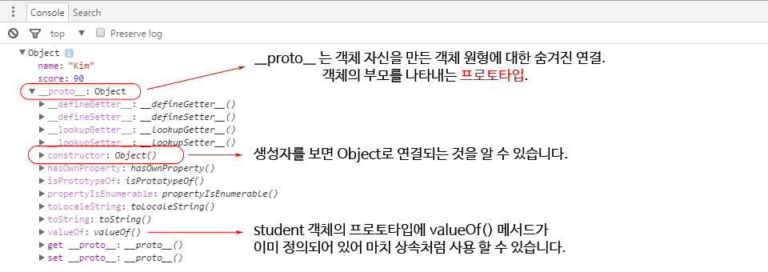

ECMAScript 6ㆍ2015 and Javascript

# ECMAScript 6 / ES2015
ecma인터내셔널의 ECMA-262 기술 규격에 정의된 표준화된 스크립트 프로그래밍 언어. 즉, JavaScript의 표준화된 버전

ECMAScript 뒤에 숫자 버전을 의미하고, 다른 하나는 출시된 연도를 의미

ES2016부터는 '해마다 표준이 추가됨'을 강조하고자 ES뒤에 해당 년도를 붙인 것만 정식 명칭

## History
현재 ECMA-262는 ECMAScript 2016 버전(2016년 6월)이 최신버전

* ECMAScript 1 : 1997
* ECMAScript 2 : 1998
* ECMAScript 3 : 1999
* ECMAScript 4 : 포기됨
* ECMAScript 5 : 2009 (현재 가장 많이 사용)
* ECMAScript 6 : 2015 (가장 큰 기능 상의 변화)
* ECMAScript 2016(ES7) : 2016
* ECMAScript 2017(ES8) : 작업중(올해 중반)

## ECMAScript 6의 새로운 기능들
let, const, Arrow Functions, Classes, Module system, Reflect, Promise, Proxy, Generators and iterators, Destructuring assignment, etc..

존 스크립트 버전의 호환성, 복잡한 웹애플리케이션 개발에 적합한 기능. 더블어 React, Angular2 ES6 지원

## ECMAScript 6 지원 현황
현재 Internet Explorer를 제외한 대부분의 최신 브라우저는 표준을 지원하는 상황


<a href="https://kangax.github.io/compat-table/es6/" target="_blank">ES6기능 지원여부 호환성 표(칸자스)</a>

## 비호환 엔진에서 ECMAScript 6 사용
### 트랜스파일러(transpiler)
ES6 문법 코드를 ES5 소스코드로 변환하는 도구. <a href="https://babeljs.io/" target="_blank">바벨</a>, <a href="https://github.com/google/traceur-compiler" target="_blank">구글 트레이서</a> 등 (깃헙 상태를 보면 바벨을 가장 많이 사용)
### 폴리필(polyfill)
특정 기능이 지원되지 않는 브라우저를 위해 사용할 수 있는 코드 조각 (<a href="https://github.com/Modernizr/Modernizr/wiki/HTML5-Cross-Browser-Polyfills#ecmascript" target="_blank">폴리필 목록</a>)


# let, const
## var vs letㆍconst
* var : 함수 스코프 (function scope)
* letㆍconst : 블록 스코프 (block scope)

## 함수 스코프 변수
* var 키워드로 선언
* 함수 밖에 선언 시, 전역범위로 스크립트 끝에서도 참조가능
* 함수 안에 선언 시, 함수 밖을 제외한 내부 어디서든 접근가능

## 예기치 않은 결과
Why no ReferenceError?
```js
var a = 12; //전역 접근 가능

function myFunction() {
    console.log(a); // -> 12
    console.log(b); // -> undefined??

    if(true) {
        var b = 13;
    } else {
        var c = 14
    }

    console.log(c); // -> 14
}

myFunction();
```

## Hoisting(호이스팅) 이란?
코드를 해석하기 전 var 선언 범위를 상단으로 이동
```js
function myFunction() {
    //var b, c; -> 변수는 호이스트 되었습니다.
    console.log(b); // -> undefined

    if(true) {
        var b = 13; //b 값이 할당 되었습니다.
    } else {
        var c = 14
    }

    console.log(b); // -> 13
    console.log(c); // -> 14
}
```

## 블록 스코프 변수
* let, const 키워드로 선언
* 함수 밖에 선언 시, 전역 접근 가능
* 블록 안에 선언 시, 자신을 정의한 블록 또는 그 하위 블록에서만 접근 가능

## let 변수 선언
* 변수 범위를 가장 가까운 블록으로 지정, 호이스팅되지 않음
* 일시적 사각지대(Temporal Dead Zone; TDZ) 존재
```js
let a = 12; //전역 접근 가능

function myFunction() {
    console.log(a); // -> 12
    console.log(b); // -> ReferenceError: b is not defined

    if(true) {
        let b = 13; //if 불록 밖에서 접근 할 수 없음
    } else {
        let c = 14 //else 불록 밖에서 접근 할 수 없음
    }

    console.log(c); // -> ReferenceError: c is not defined
}

myFunction();
```

## for반복문 안에서 var 문제
* var i는 함수 상단으로 끌어 올려지고 for loop 반복마다 공유
* setTimeout 콜백이 호출되기 전 i는 각 반복마다 증가
* 콜백이 실행되면 i는 for 반복문에서 할당 된 마지막 값을 보유
```js
function myFunction(){
    //var i;
    //for (i = 0; i < 5; i++) {

    for (var i = 0; i < 5; i++) {
        //콜백은 비동기이기 때문에 임의의 실행 전에, 반복문이 완료
        setTimeout(function() {
            console.log(i);
        }, i * 1000);
    }
    // -> 예상하는 결과 0 1 2 3 4
    // -> 5 5 5 5 5 예상과는 다르게 모든 반복에서 같은 값을 출력
}
```

## for반복문 안에서 let 사용
let은 for 반복문 안에서 공유되지 않고, 각 반복마다 새로운 변수가 생성
```js
function myFunction(){
    for (let i = 0; i < 5; i++) {
        setTimeout( () => console.log(i), i * 1000 );
    }
    // -> 0 1 2 3 4
    //각 반복에서 올바른 값을 출력
}
```

## 변수 재선언
let으로 선언된 변수는 같은 범위 내에서 동일한 변수 명을 사용 할 수 없음
```js
//ES5
var message = 'Hello';
var message = 'Goodbye';
console.log(message); // -> Goodbye

//ES6
let message = 'Hello';
let message = 'Goodbye'; //재선언은 허용되지 않음
//Uncaught SyntaxError: Identifier 'message' has already been declared

let message = 'Hello';
function myFunction(){
    let message = 'Goodbye'; //다른범위에서는 허용
}
```

## const 변수 선언 (상수)
* 일기 전용 변수, 항상 초기값 할당
* 값이 할당되면 새로운 값을 재할당 할 수 없음
```js
//ES5
function loadProfiles(userNames){
    //Magic Number. 3 그 자체로 명확한 의미를 알 수 없습니다.
    if(userNames.length > 3){
        //...
    }
}
//ES6
function loadProfiles(userNames){
    const MAX_REPLIES; //Uncaught SyntaxError: Missing initializer in const declaration
    const MAX_USERS = 3;
    MAX_USERS = 10; //Uncaught TypeError: Assignment to constant variable.

    if(userNames.length > MAX_USERS){
        //...
    }
}
```

## 하지만 조심해야 할 점
const는 다시 대입하는 것만 막지, 할당된 객체나 배열의 요소를 바꾸는 것은 막지 않습니다.
```js
//배열
const myArrary = [1, 2, 3];
myArrary[0] = 4;
console.log(myArrary); // -> [4, 2, 3]

//객체
const myObject = {name: 'Zero'};
myObject.name = 'One';
console.log(myObject); // -> {name: 'One'}

myObject = {}; //Uncaught TypeError: Assignment to constant variable
```

## var, let 둘 중 어느 것을 사용해야 하나요?
ES6 코드라면 이제 let을 사용하세요. 사실상 var은 이제 사용할 일이 없습니다.
* 변수에 새로운 값을 재할당 하려면 let
* 변수에 새로운 값을 재할당 하지 않으려면 const

# functions
## default parameter (파라미터 기본값)
parameter에 임의의 기본값을 지정할 수 있게 하는 새로운 방법을 제공
```js
//ES5
function myFunction(x, y, z){
    x = typeof x !== 'undefined' ? x : 1;
    y = typeof y !== 'undefined' ? y : 2;
    z = typeof z !== 'undefined' ? z : 3;
}
//ES6
function myFunction(x = 1, y = 2, z = 3){ //파라미터 누락 시 기본값을 사용
    console.log(x, y, z);
}

myFunction(6, 7); // -> 6, 7, 3
```

## ... rest parameter (나머지 파라미터)
함수의 파라미터 수를 예상할 수 없을 경우에 유용. 점(dot) 3개 이 후 파라미터 명을 설정하면 나머지 파라미터가 배열 객체로 넘어옵니다.
```js
//ES5
function myFunction(a, b) {
    var args = Array.prototype.slice.call(arguments, myFunction.length);
    console.log(args); // -> 3, 4, 5
}
//ES6
function myFunction(a, b, ...args) {
    console.log(args); // -> 3, 4, 5
}

myFunction(1, 2, 3, 4, 5);
```

## arguments는 이제 그만
rest / default parameter는 arguments 객체를 대체하고 좀 더 풍부하고 가독성 좋은 표현으로 자바스크립트 함수를 선언할 수 있게 합니다.

## ... spread operator (펼침 연산자)
펼침 연산자는 여러 파라미터, 여러 배열이 예상되는 곳에 각각의 요소 값을 전달
```js
function myFunction(a, b) {
    return a + b;
}

//ES5
var data = [1, 4];
var sum = myFunction.apply(null, data); //배열을 함수 파라미터로 사용 시

//ES6
let data = [1, 4];
let sum = myFunction(...data);
//...data를 먼저 1, 4로 치환 -> myFunction함수 호출

console.log(sum); // -> 5
```

## 더 강력한 배열 리터럴 (펼침 연산자)
```js
let arr1 = [1, 2];
let arr2 = [3];
let arr3 = [4, 5];

//여러 배열 병합
//ES5 – concat()
console.log(arr1.concat(arr2, arr3)); // -> [1, 2, 3, 4, 5]
//ES6
console.log([...arr1, ...arr2, ...arr3]); // -> [1, 2, 3, 4, 5]

//다른 배열에 밀어 넣기
//ES5 – apply()
arr1.push.apply(arr1, arr2);
console.log(arr1); // -> [1, 2, 3]
//ES6
arr1.push(...arr2);
console.log(arr1); // -> [1, 2, 3]

//문자열을 배열로 치환
const chars = [...'abc'];
console.log(chars); // -> ['a', 'b', 'c']
```

## arrow function (화살표 함수)
순수 함수로서의 기능만을 담당하기 위해 간소화한 함수
* "=>" 좌측에는 parameter, 우측에는 return될 내용.
* 여러줄 일 경우 { ... }로 묶을 수 있습니다.
```js
//Arrow function 문법
    () => { ... } // no parameter
     x => { ... } // one parameter, an identifier
(x, y) => { ... } // several parameters

//ES5
var addition = function(a, b) {
    return a + b;
};

//ES6
let addition = (a, b) => a + b;
```

## 함수 호출 패턴과 this 바인딩
Javascript 함수는 4가지 방식으로 호출. 그리고 함수 호출 패턴에 따라 this의 참조값이 달라집니다.

* 메소드 호출 패턴
* 함수 호출 패턴
* 생성자 호출 패턴
* call, apply 호출 패턴

## 메소드 호출 패턴
함수가 객체의 속성이면 메소드 내부의 this는 해당 메소드를 호출한 객체에 바인딩
```js
var obj1 = {
    name: 'Lee',
    sayName: function() {
        console.log(this.name);
    }
}

var obj2 = {
    name: 'Kim'
}

obj2.sayName = obj1.sayName;

obj1.sayName(); //this는 obj1, this.name -> Lee
obj2.sayName(); //this는 obj2, this.name -> Kim
```

## 함수 호출 패턴
일반 함수에서 this는 기본적으로 전역객체(window)에 바인딩. 전역함수는 물론이고, 내부함수의 경우도 this는 전역객체에 바인딩
```js
console.log(this === window); // true

function foo() {
    console.log('foo this: ',  this); //window

    function bar() {
        console.log('bar this: ', this); //window
    }
    bar();
}
foo();
```
그리고 객체 속성 메소드의 내부함수일 경우에도 this는 전역객체에 바인딩
```js
var value = 1;
var obj = {
    value: 100,
    foo: function() {
        console.log('foo this: ',  this); //obj
        console.log('foo this.value: ',  this.value); //100

        function bar() {
            console.log('bar this: ',  this); //window
            console.log('bar this.value: ', this.value); //1
        }
        bar();
    }
}
obj.foo();
```

## 생성자 호출 패턴
생성자 함수를 호출하면 this는 새로 생성되는 객체에 바인딩
```js
function Person(name) {
    this.name = name;
    console.log(this.name);
}

var me = new Person('Kim'); //this.name -> Kim
var you = new Person('Lee');  //this.name -> Lee
```
생성자 함수의 내부함수 역시, this는 전역객체에 바인딩
```js
function Person() {
    this.age = 0;

    setInterval(function() {
        //this는 전역객체(window)를 가리키므로 동작하지 않습니다.
        this.age++;
    }, 1000);
}

var me = new Person(); //this.age는 NaN
```

## 내부함수의 this가 전역객체 참조를 회피하는 방법
* 일반적으로 this를 다른변수에 할당하는 방법
* ES5 Function.prototype.bind()로 this를 바인딩
* Function.prototype.apply(), Function.prototype.call()
```js
function Person() {
    var self = this;
    this.age = 0;

    setInterval(function() {
        self.age++;
    }, 1000);

    //bind
    setInterval(function() {
        this.age++;
    }.bind(this));
}

var me = new Person(); //이제 this.age는 올바르게 증가
```

## 화살표 함수에서의 this
화살표 함수의 사용으로 직관적인 this를 사용할 수 있습니다.
```js
//ES6
function Person() {
    this.age = 0;

    setInterval(() => {
        this.age++; //'this'는 Person의 객체를 제대로 참조
    }, 1000);
}

var me = new Person(); //this.age는 올바르게 증가
```
## 화살표 함수와 일반 함수의 차이점
화살표 함수는 객체 생성자로 즉, new 연산자를 사용할 수 없음 

# destructure assignment
## 배열 해체 할당
```js
//ES5
var myArray = [1, 2, 3];
var a = myArrary[0];
var b = myArrary[1];
var c = myArrary[2];
console.log(a); //1
console.log(b); //2
console.log(c); //3

//ES6
let myArray = [1, 2, 3];
let [a, b, c] = myArray;
console.log(a); //1
console.log(b); //2
console.log(c); //3
```

## 객체 해체 할당
```js
//ES5
var user = {
    'name': '민호',
    'age' : 23
};
var name = user.name;
var age = user.age;
console.log(name); //민호
console.log(age); //23

//ES6
let user = {
    'name': '민호',
    'age' : 23
};
let {name, age} = user;
//다른 변수명 사용 시
let {name: x, age: y} = user;
console.log(x); //민호
console.log(y); //23
```

# for-of
## 배열 루프 순회하기
```js
//ES5
var array = ['a', 'b', 'c', 'd'];

for (var i = 0; i < array.length; i++) {
    var element = array[i];
}

//forEach
array.forEach(function (element) {
    //break, return 구문을 사용해 함수를 벗어날 수 없음
});

//for–in 루프 구문은 객체의 속성들을 순회하기 위한 구문
//실제 상황에서는 사용하지 마세요
for (let element in array) {
    //브라우저에 따라 요소들의 순서가 보장되지 않음
}
```

## for-of 루프
* for–of 루프 구문은 배열의 요소들, 즉 data를 순회하기 위한 구문
* for-in은 속성의 키(key)를 반복, for-of는 속성의 값(value)을 반복
```js
//문자열
for (var i in 'string') { 
    console.log(i); //0, 1, 2, 3, 4, 5
} 
for (var i of 'string') { 
    console.log(i); //s, t, r, i, n, g
} 

//배열
let array = [3, 5, 7];
array.foo = 'bar';
for (let j in array) { 
    console.log(j); //0, 1, 2, foo
} 
for (let j of array) { 
    console.log(j); //3, 5, 7
} 
//배열에서 foo라는 임의의 속성을 자동으로 걸러주고, 정상적인 요소만 표시

//DOM
var domArr = document.getElementsByTagName('div');
for (var k = 0; k < domArr.length; k++) { 
    console.log(domArr[k]); 
}

for (let l of document.getElementsByTagName('div')) { 
    console.log(l);
}
```

# collections
## Map
Map 객체는 Object와 유사. Object와 차이점은 넣은 순서가 보장되고, key가 문자열 뿐만 아니라 어떤 type도 가능합니다.
* key-value 쌍으로 이루어진 자료구조
* 저정된 순서대로 각 요소들을 반복적으로 접근. (for...of)
* key들은 중복될 수 없으며, 하나의 키에 하나의 value값

```js
let data = new Map();
data.set('foo', 123);
data.get('foo'); // 123

data.has('foo'); // true
data.delete('foo')
data.has('foo'); // false
//data.foo;
//이렇게 사용 할 수 없음


let data = new Map();
data.set('foo', true);
data.set(1, 'Number 1');

data.size; // 2
data.clear();
data.size; // 0

for (let [key, value] of data) {
    console.log(key, value);
}
```

## Set
Set은 Array와 유사. Array와 차이점은 값이 중복될 수 없습니다.

* Set은 type 상관없이 유일한 값들의 집합
* 입력된 순서에따라 저장된 요소를 반복처리 (for...of)
```js
let data = new Set();
data.add('red');

data.has('red'); // true
data.delete('red'); // true
data.has('red'); //false
//data[1];
//이렇게 값을 하나씩 확인 불가능

let data = new Set();
data.add('red');
data.add('green');

data.size; //2
data.clear();
data.size; //0

for (let item of data) {
    console.log(item);
}
```

## WeakMap, WeakSet
* WeakMap은 객체만 키로 허용하고, WeakSet도 객체만 요소로 허용
* 저장된 객체를 참조하는 값이 없을 경우 가비지 콜력션의 대상 (약한참조)
* 키(key)들을 열거할 수 없어서 크기를 알 수 없음
```js
var weakMapObj = {
    example: 'any'
};

var weakMap = new WeakMap();
weakMap.set(weakMapObj, 'zero');
weakMap.get(weakMapObj); //zero

var weakSetObj = {
    example: 'any'
};

var weakSet = new WeakSet();
weakSet.add(weakSetObj);
```

# template literals
## 템플릿 문자열
* 템플릿 문자열은 문자열을 쉽게 다루도록 도와주는 문법
* '+' 연산자를 사용하지 않아도 간단한 방법으로 새로운 문자열을 삽입 가능
```js
let a = 20;
let b = 10;
let c = '자바스크립트';

//ES5
var str = '나는 ' + (a + b) + '살이고' + c + '를 좋아해';

//ES6
let str = '나는 ${a + b}살이고 ${c}를 좋아해';
console.log(str); // -> 나는 30살이고 자바스크립트를 좋아해
```

## 여러 줄 문자열
* ‘ 또는 “ 같은 따옴표 문자 대신 ` 백틱(backtick)문자를 사용
* 줄바꿈과 들여쓰기 등 템플릿 문자열 속의 모든 white-space들은 있는 그대로 포함
```js
//ES5
var html = '';
html += '<div>';
html += '   <p>Hello World</p>';
html += '</div>';

//ES6
let html = `
<div>
    <p>Hello World</p>
</div>`;
```

# classes
## 객체지향 자바스크립트
JavaScript는 프로토타입 기반(prototype-based) 객체지향형 언어
```js
function SponsorWidget(name, description, url){
    this.name = name;
    this.description = description;
    this.url = url;
}

SponsorWidget.prototype.render = function(){
    //...
};

//SponsorWidget 함수호출
var sponsorWidget = new SponsorWidget(name, description, url);
sponsorWidget.render();
```

## JavaScript 프로토타입 (Prototype)
숫자, 문자열, 불리언(true/false), null, undefied를 제외한 모든 값은 객체

자바스크립트의 모든 객체는 자신의 부모 역할을 하는 객체와 연결되어 있고 부모 객체의 프로퍼티, 메소드를 상속받아 사용할 수 있습니다. 이러한 부모 객체를 Prototype (프로토타입)

모든 객체의 프로토타입은 객체를 생성할 때 결정
* Object.prototype
* Array.prototype
* Function.prototype

## Object.prototype
* 객체 리터럴 방식으로 생성된 객체의 경우 부모는 Object.prototype
* Object.prototype은 자바스크립트 모든 객체의 최상위 부모

student 객체는 __ proto __ ( [[Prototype]] )라는 프로퍼티에 자신의 부모 객체인 Object.prototype을 연결 (Link)
```js
var student = {
    name: 'Kim',
    score: 90
};

console.log(student.valueOf()); //Object {name: "Kim", score: 90}
console.log(student.__proto__ === Object.prototype); //true
```


## Array.prototye
배열의 부모역할을 하는 객체는 Array.prototype

모든 배열에 존재하는 length, push(), pop().. 등과 같은 메서드들은 Array.prototype 객체의 프로퍼티
```js
var myArray = [];
console.log(myArray);
```


## Function.prototye
함수의 부모 객체는 Function.prototype
```js
function sum(x, y) {
    //...
}
```


## Class 다루기
class를 선언하기 위해서는 class 키워드를 사용
```js
class SponsorWidget {
    //클래스 본문
}
```

## 생성자 함수 값 초기화
constructor는 객체 초기화를 위해 사용되는 특수한 메소드
```js
//new 연산자로 생성된 새로운 인스턴스가 있을 때 마다 실행
class SponsorWidget {
    constructor(name, description, url){
        this.name = name;
        this.description = description;
        this.url
    }

    render(){
        //...
    }
}

//new 연산자를 사용하지 않고 객체를 생성하면 에러가 발생
let sponsorWidget = new SponsorWidget(name, description, url);
sponsorWidget.render();

let widget2 = new SponsorWidget(name, description, url);
```

## 클래스에서 멤버 변수 접근
* constructor 메소드에 설정된 멤버 변수는 클래스의 모든 메소드에서 사용 가능
* this를 이용해 멤버 변수, 메소드에 접근
```js
class SponsorWidget {
    constructor(name, description, url){
        //...
        this.url = url;
    }

    render(){
        let link = this._buildLink(this.url); //멤버 변수(this.url) 사용
    }

    _buildLink(url){ //메소드 앞에 밑줄이 있으면 내부에서만 사용 규칙
        //...
    }
}
```

## 그런데 ES6의 클래스는..
ES6의 클래스가 새로운 객체지향 모델을 제공하는 것은 아닙니다. 기존 생성자 함수를 대신해 사용할 수 있는 편리한 구문 (Syntax sugar)
```js
//Syntactic Sugar
class SponsorWidget {
    //...
}

//Prototype Object Model
function SponsorWidget(name, description, url){
    //...
}

//인스턴스는 같은 방식으로 생성됩니다.
let sponsorWidget = new SponsorWidget(name, description, url);
sponsorWidget.render();

console.log(typeof SponsorWidget); //function
```

## extends 클래스 상속
* extends 키워드는 메소드와 속성을 상속받는 자식 Class를 만드는데 사용
* super는 부모클래스를 참조하기 위한 키워드
```js
class Widget { //Parent Class
    constructor(){
        this.baseCSS = 'site-widget';
    }
    parse(value){
        //...
    }
}
class SponsorWidget extends Widget { //Child Class
    constructor(name, description, url){
        super();
        //super() 함수가 먼저 호출되어야 'this' 키워드를 사용가능
        this.name = 'Square';
    }
    render(){
        let parsedName = this.parse(this.name); //Parent 메소드 상속
        let css = this._buildCSS(this.baseCSS); //Parent 변수 상속
    }
}
```

## 부모 클래스 메소드 재선언
Child Class는 super 객체를 통해 Parent Class 메소드를 호출
```js
class Widget { //Parent Class
    constructor(){
        this.baseCSS = 'site-widget';
    }
    parse(value){
        //...
    }
}
class SponsorWidget extends Widget { //Child Class
    constructor(name, description, url){
        super();
    }
    parse(){
        //Parent Class의 parse() 메소드 호출
        let parsedName = super.parse(this.name);
    }
    render(){
        //...
    }
}
```

# modules - part I
## JavaScript의 전역은 매우 쉽게 오염
JavaScript는 일반적으로 전역변수를 사용. 이로인해 예기치 않은 문제점들이 발생할 가능성이 높아집니다.
```html
<!DOCTYPE html>
<body>
    <script src="./jquery.js"></script>
    <script src="./underscore.js"></script>
    <script src="./flash-message.js"></script>
    <script>
    let element = $("...").find(...);
    let filtered = _.each(...);
    flashMessage("Hello");

    //라이브러리들이 Global Namespace에 추가
    //전역변수 사용으로 인해
    //네이밍이 충돌 될 수 있는 잠재적인 오류가 발생 할 수 있습니다.
    //필요한 코드와 필요하지 않는 코드를 구분하는 것이 매우 어려운 일
    <script>
</body>   
```

## 모듈(modules) 정의
* 하나가 코드를 여러개의 파일로 분리하는 것
* 전역변수 사용을 줄이고 그로 인한 문제점을 예방
* 자주 사용되는 코드를 별도의 파일로 만들어 필요할 때마다 재사용

## 모듈 생성
export 키워드를 사용해 모듈을 외부로 보낼 수 있습니다.
```js
//flash-message.js
export default function(message){
    alert(message);
}
//messages를 표시하기 위한 모듈 생성합니다.
//default type export는 하나의 함수를 내보내는 방법입니다.
```

## default export - 모듈 가져오기
* 모듈을 가져오려면 import키워드를 사용
* 내용을 저정할 로컬변수를 지정하고
* from 키워드를 사용하여 모듈이 위치한 경로를 작성

```js
//app.js
//default export로 보내면 이름을 지정할 수 있습니다.
import flashMessage from './flash-message'; //.js파일확장자는 생략
flashMessage('Hello');

//flash-message.js
export default function(message){
    alert(message);
}
```

## default export - 여러 함수를 내보낼 수 없음
default export는 모듈에서 내보낼 수 있는 함수의 수를 제한
```js
//flash-message.js
export default function(message){
    alert(message);
}

//consoleMessage 함수는 모듈 외부에서 사용할 수 없습니다.
function consoleMessage(message){
    console.log(message);
}
```

## named export - 내보내기
단일 모듈에서 여러 함수를 내 보내려면 named(명명된) Export를 사용할 수 있습니다.
```js
//flash-message.js
//export뒤에 default type을 사용하지 않습니다.
export function alertMessage(message){
    alert(message);
}

export function consoleMessage(message){
    console.log(message);
}
```

## named export - 가져오기
named(명명된) export 함수 이름과 동일한 이름을 변수로 중괄호 안에 묶어야합니다.
함수이름이 일치해야합니다.
```js
//app.js
import { alertMessage, consoleMessage } from './flash-message';

alertMessage('Hello from alert');
consoleMessage('Hello from log');
```

## 모듈을 객체로 가져오기
전체 모듈을 객체로 가져와서 객체의 속성으로 호출할 수 있습니다. 함수가 객체 속성이됩니다.
```js
//app.js
import * as flash from './flash-message';

flash.alertMessage('Hello from alert');
flash.consoleMessage('Hello from log');
```

## 한 번에 여러 함수 내보내기 (반복되는 export 제거)
여러 함수를 중괄호에 묶어서 한 번에 외부로 보낼 수 있습니다.
```js
//flash-message.js
function alertMessage(message){
    alert(message);
}

function consoleMessage(message){
    console.log(message);
}
export { alertMessage, consoleMessage }
//중괄호 안에 여러 함수 이름을 작성 할 수 있습니다.
```

# modules - part II
## 하드코딩된 상수 모듈화
응용프로그램에서 상수를 재정의 하는 것은 불필요한 반복이고, 버그로 이어질 수 있습니다.
```js
//load-profiles.js
function loadProfiles(userNames){
    const MAX_USERS = 3; //상수를 정의
    if(userNames.length > MAX_USERS){
        //...
    }
    const MAX_REPLIES = 3; //상수를 정의
    if(someElement > MAX_REPLIES){
        //...
    }
}
export { loadProfiles }
```
```js
//list-replies.js
function listReplies(replies=[]){
    const MAX_REPLIES = 3;
    //다른곳에도 다시 정의
    if(replies.length > MAX_REPLIES){
    //...
    }
}
export { listReplies }
```
```js
//display-watchers.js
function displayWatchers(watchers=[]){
    const MAX_USERS = 3;

    if(watchers.length > MAX_USERS){
    //...
    }
}
export { displayWatchers }
```

## 상수 내보내기
모듈에 상수를 배치하면 다른 모듈에서 재사용 할 수 있습니다.
```js
//constants.js
/*
export const MAX_USERS = 3;
export const MAX_REPLIES = 3;
*/
const MAX_USERS = 3;
const MAX_REPLIES = 3;

export { MAX_USERS, MAX_REPLIES };
```

## 상수를 가져오는 방법
상수를 가져오려면, 함수를 가져올 때와 같은 구문을 사용할 수 있습니다.
```js
//load-profiles.js
import { MAX_REPLIES, MAX_USERS } from './constants';

function loadProfiles(userNames){
    if(userNames.length > MAX_USERS){
        //...
    }
    if(someElement > MAX_REPLIES){
        //...
    }
}
```

## 상수 가져오기
이제 다른 파일에서도 상수를 가져와서 사용할 수 있습니다.
```js
//list-replies.js
import { MAX_REPLIES } from './constants';

function listReplies(replies = []){
    if(replies.length > MAX_REPLIES){
        //...
    }
}
```
```js
//display-watchers.js
import { MAX_USERS } from './constants';

function displayWatchers(watchers = []){
    if(watchers.length > MAX_USERS){
        //...
    }
}
```


## default export - 클래스 모듈 내보내기
클래스도 함수와 동일한 구문을 사용해 모듈에서 내보낼 수 있습니다.
```js
//flash-message.js
//default는 이 클래스를 가져 올 때 이름을 변경 할 수 있습니다.
export default class FlashMessage {
    constructor(message){
        this.message = message;
    }

    renderAlert(){
        alert(`${this.message} from alert`);
    }

    renderConsole(){
        console.log(`${this.message} from log`);
    }
}
```

## default export - 클래스 모듈 사용
import를 사용해 가져온 클래스는 변수에 할당되고, 새로운 인스턴스를 만드는데 사용할 수 있습니다.
```js
//app.js
import MyMessage from './flash-message'; //변수 이름 변경

let flash = new MyMessage('Hello'); //인스턴스를 생성하고, 인스턴스 메소드를 호출합니다.
flash.renderAlert();
flash.renderConsole();
```

## named export - 클래스 모듈 내보내기
클래스를 내보내는 또 다른 방법으로 클래스를 먼저 정의한 다음, 중괄호 안에 클래스 이름과 함께 export를 사용합니다.
```js
//flash-message.js
class FlashMessage { //일반적인 클래스 선언
    constructor(message){
        this.message = message;
    }

    renderAlert(){
        alert(`${this.message} from alert`);
    }

    renderLog(){
        console.log(`${this.message} from log`);
    }
}
export { FlashMessage } //외부로 클래스를 보냅니다.
```

## named export - 클래스 모듈 사용
마찬가지로 named(명명된) export, import를 사용할 때는 클래스 이름과 동일한 이름을 변수로 중괄호 안에 묶어야합니다. (중괄호 안에 이름 일치)
```js
//app.js
import { FlashMessage } from './flash-message';

let flash = new FlashMessage("Hello");
flash.renderAlert();
flash.renderLog();
```

# promise
## 이전의 비동기식 프로그래밍 구현 방법
Callback Hell은 코드의 가독성이 떨어져 이해하기 어럽고, 실수를 유발시킬 확률이 높습니다.
```js
async1(function(input, result1) {
    async2(function(result2) {
        async3(function(result3) {
            async4(function(result4) {
                async5(function(output) {
                    // do something with output
                });
            });
        });
    });
});
```

## promise 선언
Promise는 비동기 처리가 성공, 실패 했는지 상태 정보와 처리 종료 후 실행될 콜백함수 then() 담고 있는 객체입니다.
```js
let asyncFunction = function(param) {
    return new Promise(function(resolve, reject) {
         //비동기 함수
        setTimeout(function() {
            //처리가 끝나면 resolve 또는 reject을 반환
            if (param) {
                resolve('성공');
            } else {
                reject(Error('실패'));
            }
        }, 2000);
    });
};
```

## promise 실행
* 비동기 처리가 성공적으로 끝났을 때 호출될 콜백을 promise 객체의 then() 정의
* 실패했을 때 호출될 콜백은 catch() 정의
```js
asyncFunction(true).then(function(data) {
    // resolve가 실행된 경우(성공)
    console.log(data);

}).catch(function(error) {
    // reject가 실행된 경우(실패)
    console.error(error);
});
```

# generators
## generators
실행 중간에 값을 반환할 수 있고, 다른 작업을 처리한 후, 다시 그 위치에서 코드를 시작
* function* 표기
* next()메소드 실행 시 yield키워드를 만나면 실행을 중지, yield된 값을 반환
* 다시 next() 메소드가 호출되면 진행이 멈췄던 부분에서부터 실행, yield된 값 반환
* done 프로퍼티로 generator 함수의 완료여부 확인
```js
function* generatorFunction() {
    yield 1;
    yield 2;
    yield 3;
}

let generator = generatorFunction();
console.log(generator.next().value); //1
console.log(generator.next().value); //2
console.log(generator.next().value); //3
console.log(generator.next().done);  //true
```